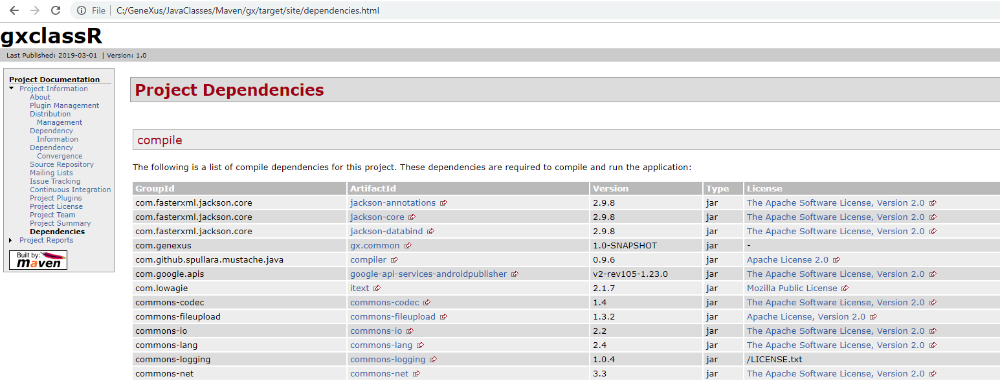

# JavaClasses (Working Process, these classes are not intended to be used as release library yet)

GeneXus Standard Classes for Java.

GeneXus Standard Classes for Android. *This is not the full runtime for Android, the full runtime can be created by using the Android Flexible Client project*

# Requirements

- JDK 6 or superior
- Maven 3.6 or superior

# Projects Description

Maven directory is a project that allows you to build multiple modules.

# Modules

## common
Classes common to Android and Java

## gxcryptocommon

Classes common to Android and Java related to Cryptography

## apacheandroid

Android apache class dependence. These were separated by size issues. They are candidates to disappear in the near future.

## gxmail

Classes related to mail handling.

## gx

Java standard classes

## gxoffice

Formerly Java classes are now separated to be included only when using office.

## gxsearch

Formerly in Java classes are now separated to be included only when using search.

## gxandroidpublisher and javapns

They are necessary for when you have Push Notifications in your old implementation. These are projects that should disappear in the short term.

## Android

The standard Android classes.

The dependencies between the projects are specified in each pom.xml within their directory.

# How to build all

- Download or clone the project.
- Open a windows command prompt and move to the <project dir> directory
- Run mvnLocal.bat
  This will install 1 legacy jar file in the local repository of Maven. And the SAP jar file.
- mvn compile (will compile the whole project)

# How to build a specific project

- cd <project specific dir>
- mvn compile

 # How to package all or some project

 mvn package

 # How to copy dependencies jar files to the dependency directory

 - cd gx
 - mvn dependency:copy-dependencies

 # How to create a Site with the specification of each module

 - mvn site

 (Android site is failing)
 (when processing xmlsec exception are raised but the process continue)

 The site for each module can be found at <project dir>\target\site\index.html

  
